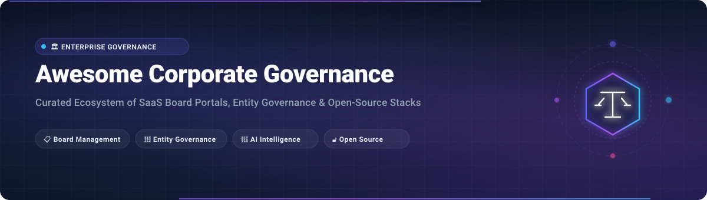

<div align="center">



# 🏛️ Awesome Corporate Governance Platform

### 🚀 The Definitive Ecosystem of Corporate Governance Platforms, Board Portals, Entity Management & Open-Source Governance Stacks

<p align="center">
  <a href="https://github.com/ishandutta2007/Awesome-Awesome-Awesome"></a><a href="https://discord.gg/jc4xtF58Ve"></a> <a href="https://github.com/ishandutta2007/Awesome-Corporate-Governance-Platform/stargazers"></a> <a href="https://github.com/ishandutta2007/Awesome-Corporate-Governance-Platform/network/members"></a> <a href="https://github.com/ishandutta2007/Awesome-Corporate-Governance-Platform/blob/main/LICENSE"></a> <a href="https://github.com/ishandutta2007/Awesome-Corporate-Governance-Platform/pulls"></a> <a href="https://github.com/ishandutta2007"></a>
</p>

*A curated directory and architectural reference of SaaS / hosted platforms and open-source software for Board Management, Corporate Governance, Board Portals, Entity Governance, Meeting Management, Decision Management, Compliance, and Governance Operations.*

**📅 Last updated: August 2026**

</div>

---

## 📖 Overview

Modern **Corporate Governance Platforms** and **Board Portal Software** empower boards of directors, general counsels, corporate secretaries, compliance officers, and executive leadership teams to orchestrate high-stakes governance workflows with institutional-grade security, transparency, and operational rigor.

Key capabilities across this ecosystem include:
- 📋 **Board Portals & Meeting Management**: Digital board books, interactive agendas, meeting packet collation, minutes drafting, and automated distribution.
- 🗳️ **Resolutions & Decision Registers**: Formal voting, unanimous written consents (UWC), resolution logs, and tamper-evident decision records.
- 🏢 **Entity Governance & Subsidiary Management**: Legal entity structures, org charts, ownership cap tables, officer registers, and statutory filings.
- ✍️ **E-Signatures & Approvals**: Multi-tier approvals, director sign-offs, and compliance sign-off workflows.
- 🤖 **AI Governance Intelligence**: Automated meeting minutes, board pack summarization, agenda generation, and governance Q&A.
- 🔐 **Enterprise Security & Compliance**: Role-based access control (RBAC), multi-factor authentication (MFA), end-to-end encryption, and audit trails.

---

## 📑 Table of Contents

- [🏢 SaaS / Hosted Platforms](#-saas--hosted-platforms)
- [🔓 Open-Source GitHub Projects](#-open-source-github-projects)
  - [🗳️ Direct Governance & Decision Platforms](#️-direct-governance--decision-platforms)
  - [📄 Document, Board-Pack & E-Signature Management](#-document-board-pack--e-signature-management)
  - [🤝 Collaboration & Governance Knowledge Base](#-collaboration--governance-knowledge-base)
  - [⚡ Workflow Automation & Compliance Orchestration](#-workflow-automation--compliance-orchestration)
  - [🏭 ERP, Corporate Administration & Entity Management](#-erp-corporate-administration--entity-management)
  - [🛡️ Identity, Access Control & Governance Security](#️-identity-access-control--governance-security)
  - [🤖 AI Governance & Board Intelligence](#-ai-governance--board-intelligence)
  - [📊 Search, Vector Retrieval & Governance Analytics](#-search-vector-retrieval--governance-analytics)
- [🏗️ Open-Source Corporate Governance Architecture Stack](#️-open-source-corporate-governance-architecture-stack)
- [🧩 Corporate Governance Building Blocks](#-corporate-governance-building-blocks)
- [💡 Important Corporate Governance Concepts](#-important-corporate-governance-concepts)
- [⭐ Star History](#-star-history)
- [🤝 How to Contribute](#-how-to-contribute)
- [📜 Disclaimer](#-disclaimer)

---

## 🏢 SaaS / Hosted Platforms

Below is a curated comparison of leading commercial corporate governance platforms and board portals, sorted in **descending order by company scale** (estimated annual revenue / corporate valuation):

| Platform | Core Governance Focus | Company Scale (Revenue / Valuation) | Pricing (Starting Tier) | Free Tier / Free Trial Limits |
| :--- | :--- | :--- | :--- | :--- |
| **[Nasdaq Boardvantage](https://www.nasdaq.com/solutions/boardvantage)** | Secure enterprise board portal, document collaboration, meeting approvals, and governance records | Market Cap: **~$40B+**<br>Revenue: **~$6.5B+** (Nasdaq, Inc.) | Starts at ~$15,000/year (all-inclusive enterprise tier package) | 30-day proof-of-concept pilot available for qualified enterprise boards upon request |
| **[CSC Entity Management](https://www.cscglobal.com/)** | Enterprise legal entity management, corporate record-keeping, officer registers, and compliance | Valuation: **~$10B+**<br>Revenue: **~$2.0B+** (Corporation Service Company) | Starts at ~$3,500/year (flat-rate base tier including unlimited users) | 14-day guided sandbox access with test compliance calendars upon consultation |
| **[Diligent One](https://www.diligent.com/platform/diligent-one)** | Unified platform connecting board governance, enterprise risk, compliance, and audit oversight | Valuation: **~$7.0B+**<br>Revenue: **~$600M+ ARR** (Diligent Corporation) | Starts at ~$5,000/year (entry platform tier for base governance workflows) | 30-day free trial for GovernAI / AI Minutes module; 14-day guided sandbox pilot upon request |
| **[Diligent Boards](https://www.diligent.com/products/boards)** | Enterprise board portal with secure board books, voting, resolutions, annotations, and AI prep | Valuation: **~$7.0B+**<br>Revenue: **~$600M+ ARR** (Diligent Corporation) | Starts at ~$5,000/year (or ~$450/user/year based on board size) | 30-day free trial for GovernAI features (AI-generated minutes & summaries); sales pilot available |
| **[Diligent Entities](https://www.diligent.com/)** | Corporate entity management, subsidiary ownership structures, compliance calendars, and filings | Valuation: **~$7.0B+**<br>Revenue: **~$600M+ ARR** (Diligent Corporation) | Starts at ~$10,000/year (core entity governance for mid-market portfolios) | 30-day evaluation sandbox environment with sample entity records upon qualification |
| **[Diligent Director & Trustee Platform](https://www.diligent.com/solutions/directors-and-trustees)** | Specialized governance portal for trustees, directors, advisory boards, and education modules | Valuation: **~$7.0B+**<br>Revenue: **~$600M+ ARR** (Diligent Corporation) | Starts at ~$5,000/year (specialized director/trustee license tier) | 30-day GovernAI feature trial and 14-day interactive trustee sandbox on request |
| **[BoardEffect](https://www.boardeffect.com/)** | Board governance, committee collaboration, surveys, meeting books, and compliance records | Valuation: **~$7.0B+**<br>Revenue: **~$600M+ ARR** (Diligent Group brand) | Starts at ~$3,000/year (Pro tier for non-profits, healthcare, and education boards) | 14-day guided evaluation pilot with test board books and committee workflows upon request |
| **[OnBoard](https://www.onboardmeetings.com/)** | Digital board books, intelligent agendas, minutes builder, secure messaging, and Zoom integration | Valuation: **~$300M+**<br>Revenue: **~$45M - $60M ARR** (Passageways, Inc.) | Starts at ~$2,400/year (~$200/month for Essentials tier, up to 10 users) | 30-day free trial with full platform access (agenda creation, meeting books, and annotations) |
| **[Convene](https://www.azeusconvene.com/)** | Enterprise board portal for secure board books, live meeting annotations, voting, and audit trails | Market Cap: **~$150M+**<br>Revenue: **~$50M+** (Azeus Systems Holdings) | Starts at ~$400/user/year (or £195/user/year for public sector entry tier) | 30-day free trial with complete platform functionality and multi-device access without commitment |
| **[Board Intelligence](https://www.boardintelligence.com/)** | Board reporting, board pack quality optimization, decision-support, and governance intelligence | Valuation: **~$150M+**<br>Revenue: **~$35M - $45M ARR** (Board Intelligence Ltd) | Starts at ~£7,700/year (~$9,800/year platform base fee via G-Cloud framework) | 14-day guided evaluation pilot with custom board paper templates upon demo request |
| **[Aprio](https://www.aprio.com/)** | Secure board management, committee workflows, document repositories, and decision records | Valuation: **~$120M+**<br>Revenue: **~$30M - $40M ARR** (Aprio Inc.) | Starts at ~$4,000/year flat subscription (includes up to 20 users and unlimited administrators) | 30-day full-access free trial with dedicated onboarding and sample board pack setup |
| **[Sherpany](https://www.sherpany.com/)** | Executive and board meeting management, agenda coordination, and decision registers | Valuation: **~$100M+**<br>Revenue: **~$20M - $30M ARR** (Sherpany AG) | Starts at ~$5,000/year (~€400/month for Board starter package) | 14-day interactive demo pilot with test meeting rooms and agenda collaboration |
| **[iBabs](https://www.ibabs.com/)** | Meeting management, board portals, agenda distribution, voting, and decision logs | Valuation: **~$80M+**<br>Revenue: **~$20M - $25M ARR** (Euronext Corporate Services) | Starts at £12.64/user/month (~$16/user/month, minimum 10 users / ~$1,920/year) | 30-day free trial with full access to agenda preparation, document annotations, and secure voting |
| **[Athennian](https://www.athennian.com/)** | Entity governance operations, org charts, ownership tracking, director appointments, and filings | Valuation: **~$80M+**<br>Revenue: **~$15M - $25M ARR** (Athennian Inc.) | Starts at ~$25,000/year (Essentials tier for legal and corporate entity management) | 14-day guided proof-of-concept pilot with sample entity imports upon consultation |
| **[Boardable](https://boardable.com/)** | Board management, agenda builder, packet distribution, voting, minutes, and e-signatures | Valuation: **~$50M+**<br>Revenue: **~$10M - $15M ARR** (Boardable Inc.) | Starts at $49/month (billed annually; or ~$17.99/user/month for Essentials) | 14-day free trial with full feature access (agenda builder, document sharing, e-signatures; no credit card required) |
| **[BoardPAC](https://www.boardpac.co/)** | Paperless board meeting automation, encrypted board packs, voting, approvals, and e-signatures | Valuation: **~$45M+**<br>Revenue: **~$10M - $15M ARR** (BoardPAC Pvt Ltd) | Starts at ~$3,600/year (~$300/month for standard board package) | 14-day guided interactive trial pilot with sample meeting packs upon sales setup |
| **[BoardPro](https://www.boardpro.com/)** | Board packs, meeting minutes, decision registers, action tracking, and e-signatures | Valuation: **~$30M+**<br>Revenue: **~$6M - $10M ARR** (BoardPro Ltd) | Starts at $1,500/year flat rate per board (Small Board/Nonprofit tier) | 30-day free trial with full feature access, unlimited users, and data retention upon upgrade (no credit card required) |
| **[BoardPro AI](https://www.boardpro.com/boardpro-ai)** | AI-powered board pack summarization, agenda generation, and automated meeting minutes | Valuation: **~$30M+**<br>Revenue: **~$6M - $10M ARR** (BoardPro Ltd) | Starts at $50/month add-on (or bundled in higher BoardPro tiers) | 30-day free trial included alongside BoardPro's standard 30-day platform trial |
| **[Governance.com](https://www.governance.com/)** | Corporate governance automation, meeting orchestration, decision tracking, and task management | Valuation: **~$15M+**<br>Revenue: **~$3M - $6M ARR** (Governance.com) | Starts at ~€5,000/year (~€415/month for core governance modules) | 14-day interactive sandbox trial upon demo consultation |
| **[BoardCloud](https://www.boardcloud.net/)** | Board papers, meeting agendas, minutes, digital collaboration, and governance repositories | Valuation: **~$12M+**<br>Revenue: **~$2M - $5M ARR** (SyncData Pty) | Starts at $18.99/user/month (with annual discount tiers available) | 30-day free trial with full access to meeting pack creation and unlimited test board documents |
| **[BoardSpace](https://www.boardspace.com/)** | Board portal for minutes, agendas, tasks, compliance records, and committee tracking | Valuation: **~$8M+**<br>Revenue: **~$1M - $3M ARR** (BoardSpace Inc.) | Starts at $69/month (Condos/HOAs) or $99/month (Non-profits & Charities) | 14-day guided sandbox trial upon demo request with sample board archives and test workflows |
| **[eMeetings](https://www.emeetings.com/)** | Digital meeting management, automated agenda compilation, minute approval, and decision history | Valuation: **~$5M+**<br>Revenue: **~$1M - $2M ARR** (eMeetings / C-zentrix) | Starts at ~$1,200/year (~$100/month for Basic tier up to 10 users) | 14-day free trial with full access to agenda creation, minute drafting, and pack exports |

## 🔓 Open-Source GitHub Projects

Each repository below includes a live GitHub star badge linking directly to its stargazers page, sorted by star count in descending order within each category:

### 🗳️ Direct Governance & Decision Platforms

- **[Snapshot](https://github.com/snapshot-labs/snapshot)** [](https://github.com/snapshot-labs/snapshot/stargazers) — Off-chain governance and voting system with gasless signature verification, proposal creation, and multi-strategy voting execution.
- **[OpenPR](https://github.com/openprx/openpr)** [](https://github.com/openprx/openpr/stargazers) — Open-source project management and corporate governance platform with a dedicated governance center supporting proposals, configurable voting, decision records, audit logs, veto/escalation workflows, trust scores, AI agents, and MCP integration.
- **[Loomio](https://github.com/loomio/loomio)** [](https://github.com/loomio/loomio/stargazers) — Collaborative decision-making platform supporting proposals, discussions, consent voting, decision registers, and group governance.
- **[Decidim](https://github.com/decidim/decidim)** [](https://github.com/decidim/decidim/stargazers) — Modular participatory governance platform with citizen/member proposals, strategic consultations, meetings, and transparent voting.
- **[Consul Democracy](https://github.com/consuldemocracy/consuldemocracy)** [](https://github.com/consuldemocracy/consuldemocracy/stargazers) — Open-source e-governance platform for citizen and stakeholder proposals, debates, voting, and participatory budgeting.
- **[Pol.is](https://github.com/compdemocracy/polis)** [](https://github.com/compdemocracy/polis/stargazers) — Consensus-building platform with advanced machine-learning opinion clustering for stakeholder consultation and alignment.
- **[Votiverse](https://github.com/votiverse/votiverse)** [](https://github.com/votiverse/votiverse/stargazers) — Open governance and voting engine designed for locally runnable governance systems with proposals, proxy voting, delegations, surveys, and multi-tenant member administration.

---

### 📄 Document, Board-Pack & E-Signature Management

- **[Stirling-PDF](https://github.com/Stirling-Tools/Stirling-PDF)** [](https://github.com/Stirling-Tools/Stirling-PDF/stargazers) — Self-hosted PDF manipulation suite for compiling, merging, redacting, watermarking, and securing board packs and meeting packets.
- **[Paperless-ngx](https://github.com/paperless-ngx/paperless-ngx)** [](https://github.com/paperless-ngx/paperless-ngx/stargazers) — Document management system with OCR, automated tagging, full-text indexing, and secure archival for corporate policies, resolutions, and board books.
- **[Documenso](https://github.com/documenso/documenso)** [](https://github.com/documenso/documenso/stargazers) — Open-source digital signature infrastructure for board resolutions, director consent forms, and corporate approvals.
- **[Mayan EDMS](https://github.com/mayan-edms/Mayan-EDMS)** [](https://github.com/mayan-edms/Mayan-EDMS/stargazers) — Enterprise electronic document management system supporting document storage, retention lifecycles, role permissions, and cryptographic auditability.
- **[Docspell](https://github.com/eikek/docspell)** [](https://github.com/eikek/docspell/stargazers) — Intelligent document management and organization system with machine-learning metadata classification for corporate records.
- **[Teedy](https://github.com/sismics/docs)** [](https://github.com/sismics/docs/stargazers) — Lightweight document management system for storing, indexing, and sharing meeting minutes and governance files.
- **[OpenKM Community](https://github.com/openkm/document-management-system)** [](https://github.com/openkm/document-management-system/stargazers) — Document management system providing structured repositories, check-in/out workflows, and audit trails for governance documents.

---

### 🤝 Collaboration & Governance Knowledge Base

- **[AppFlowy](https://github.com/AppFlowy-IO/AppFlowy)** [](https://github.com/AppFlowy-IO/AppFlowy/stargazers) — Privacy-first open-source workspace for board wikis, task tracking, meeting agendas, and director notes.
- **[AFFiNE](https://github.com/toeverything/AFFiNE)** [](https://github.com/toeverything/AFFiNE/stargazers) — Next-gen knowledge base and visual whiteboard for board strategy planning, meeting notes, and governance docs.
- **[Nextcloud Server](https://github.com/nextcloud/server)** [](https://github.com/nextcloud/server/stargazers) — Self-hosted collaboration platform with private files, encrypted communications, calendar coordination, and document sharing.
- **[Mattermost](https://github.com/mattermost/mattermost)** [](https://github.com/mattermost/mattermost/stargazers) — Secure collaboration and messaging platform designed for confidential executive and board committee communication.
- **[Outline](https://github.com/outline/outline)** [](https://github.com/outline/outline/stargazers) — Fast, collaborative team knowledge base for company bylaws, governance charters, board manuals, and committee policies.
- **[Wiki.js](https://github.com/requarks/wiki)** [](https://github.com/requarks/wiki/stargazers) — Modern, extensible wiki platform for maintaining governance documentation and board policy repositories.
- **[BookStack](https://github.com/BookStackApp/BookStack)** [](https://github.com/BookStackApp/BookStack/stargazers) — Simple, self-hosted platform for organizing board manuals, corporate governance handbooks, and compliance standards.
- **[Element Web](https://github.com/element-hq/element-web)** [](https://github.com/element-hq/element-web/stargazers) — End-to-end encrypted Matrix client for private board executive messaging and secure communications.

---

### ⚡ Workflow Automation & Compliance Orchestration

- **[n8n](https://github.com/n8n-io/n8n)** [](https://github.com/n8n-io/n8n/stargazers) — Fair-code workflow automation tool for orchestrating board pack distribution, compliance reminders, approval alerts, and CRM/ERP integrations.
- **[Apache Airflow](https://github.com/apache/airflow)** [](https://github.com/apache/airflow/stargazers) — Programmatic workflow management platform for scheduled governance filings, compliance reporting, and regulatory data pipelines.
- **[Node-RED](https://github.com/node-red/node-red)** [](https://github.com/node-red/node-red/stargazers) — Low-code event-driven programming tool for wiring together governance alerts, hardware tokens, and compliance webhooks.
- **[Activepieces](https://github.com/activepieces/activepieces)** [](https://github.com/activepieces/activepieces/stargazers) — Open-source no-code business automation tool for automating board notices, e-sign handoffs, and director task notifications.
- **[Windmill](https://github.com/windmill-labs/windmill)** [](https://github.com/windmill-labs/windmill/stargazers) — Developer platform for building multi-step approval workflows, governance scripts, internal admin panels, and audit endpoints.
- **[Temporal](https://github.com/temporalio/temporal)** [](https://github.com/temporalio/temporal/stargazers) — Resilient, stateful workflow orchestration engine designed for mission-critical compliance sequences and long-running approval lifecycles.
- **[Kestra](https://github.com/kestra-io/kestra)** [](https://github.com/kestra-io/kestra/stargazers) — Declarative event-driven orchestrator for automating governance schedules, statutory reporting, and data audit flows.

---

### 🏭 ERP, Corporate Administration & Entity Management

- **[NocoDB](https://github.com/nocodb/nocodb)** [](https://github.com/nocodb/nocodb/stargazers) — Open-source Airtable alternative for tracking subsidiary corporate entities, cap tables, director appointments, and compliance calendars.
- **[Odoo Community](https://github.com/odoo/odoo)** [](https://github.com/odoo/odoo/stargazers) — Comprehensive suite of open business applications covering company administration, sign workflows, document management, and compliance.
- **[Frappe ERPNext](https://github.com/frappe/erpnext)** [](https://github.com/frappe/erpnext/stargazers) — Enterprise management platform with accounting, asset registers, procurement, company administration, and role permissions.
- **[Frappe Framework](https://github.com/frappe/frappe)** [](https://github.com/frappe/frappe/stargazers) — Full-stack Python/JS web application framework ideal for building custom entity governance and compliance portals.
- **[Dolibarr ERP/CRM](https://github.com/Dolibarr/dolibarr)** [](https://github.com/Dolibarr/dolibarr/stargazers) — Open-source ERP/CRM suite for managing enterprise foundations, associations, corporate entities, and contracts.
- **[Tryton](https://github.com/tryton/tryton)** [](https://github.com/tryton/tryton/stargazers) — Modular, scalable business framework for bespoke enterprise corporate governance and regulatory reporting.

---

### 🛡️ Identity, Access Control & Governance Security

- **[Keycloak](https://github.com/keycloak/keycloak)** [](https://github.com/keycloak/keycloak/stargazers) — Open-source Identity and Access Management providing SSO, SAML 2.0, OpenID Connect, MFA, and role federation for board portals.
- **[Authentik](https://github.com/goauthentik/authentik)** [](https://github.com/goauthentik/authentik/stargazers) — Flexible open-source identity provider with built-in MFA, user self-service, and granular directory access control.
- **[Authelia](https://github.com/authelia/authelia)** [](https://github.com/authelia/authelia/stargazers) — Single sign-on and two-factor authentication companion for securing internal corporate governance portals and reverse proxies.
- **[Casbin](https://github.com/casbin/casbin)** [](https://github.com/casbin/casbin/stargazers) — Authorization library supporting RBAC, ABAC, and multi-tenant access models for governance applications.
- **[Open Policy Agent (OPA)](https://github.com/open-policy-agent/opa)** [](https://github.com/open-policy-agent/opa/stargazers) — Policy-based control engine for enforcing unified governance rules, compliance boundaries, and data access policies.
- **[Wazuh](https://github.com/wazuh/wazuh)** [](https://github.com/wazuh/wazuh/stargazers) — Unified security monitoring, threat detection, and regulatory compliance platform for safeguarding governance infrastructure.
- **[Zitadel](https://github.com/zitadel/zitadel)** [](https://github.com/zitadel/zitadel/stargazers) — Cloud-native multi-tenant identity infrastructure with fine-grained authorization and audit logging.
- **[immudb](https://github.com/codenotary/immudb)** [](https://github.com/codenotary/immudb/stargazers) — Immutable, cryptographically verifiable database for tamper-proof board resolutions, voting logs, and audit trails.

---

### 🤖 AI Governance & Board Intelligence

- **[Ollama](https://github.com/ollama/ollama)** [](https://github.com/ollama/ollama/stargazers) — Run large language models locally and privately for on-premises board paper analysis without exposing confidential data.
- **[LangChain](https://github.com/langchain-ai/langchain)** [](https://github.com/langchain-ai/langchain/stargazers) — Open-source framework for building contextual AI assistants, meeting pack analyzers, and governance reasoning agents.
- **[Open WebUI](https://github.com/open-webui/open-webui)** [](https://github.com/open-webui/open-webui/stargazers) — Self-hosted AI interface for private director Q&A over internal board books, minutes, and corporate policies.
- **[Dify](https://github.com/langgenius/dify)** [](https://github.com/langgenius/dify/stargazers) — Open-source LLM app development platform for orchestrating AI governance assistants, RAG pipelines, and automated minute-taking.
- **[LlamaIndex](https://github.com/run-llama/llama_index)** [](https://github.com/run-llama/llama_index/stargazers) — Data framework for connecting custom board books, historical minutes, bylaws, and governance records to LLMs.
- **[LangGraph](https://github.com/langchain-ai/langgraph)** [](https://github.com/langchain-ai/langgraph/stargazers) — Framework for building stateful, multi-actor AI agent workflows for multi-step governance review and compliance audits.
- **[Haystack](https://github.com/deepset-ai/haystack)** [](https://github.com/deepset-ai/haystack/stargazers) — End-to-end framework for semantic search, question answering, and RAG over legal and board document collections.

---

### 📊 Search, Vector Retrieval & Governance Analytics

- **[Grafana](https://github.com/grafana/grafana)** [](https://github.com/grafana/grafana/stargazers) — Interactive visualization and operational analytics platform for governance audit logs, security events, and compliance health.
- **[Apache Superset](https://github.com/apache/superset)** [](https://github.com/apache/superset/stargazers) — Enterprise business intelligence and visualization platform for board metrics, compliance tracking, and governance KPIs.
- **[Apache ECharts](https://github.com/apache/echarts)** [](https://github.com/apache/echarts/stargazers) — Powerful charting and visualization library for rendering entity hierarchy trees, ownership cap tables, and board analytics.
- **[Metabase](https://github.com/metabase/metabase)** [](https://github.com/metabase/metabase/stargazers) — Intuitive analytics and business intelligence tool for exploring governance metrics, meeting attendance, and resolution logs.
- **[Meilisearch](https://github.com/meilisearch/meilisearch)** [](https://github.com/meilisearch/meilisearch/stargazers) — Lightning-fast, typo-tolerant full-text search engine for instant retrieval of board resolutions and policies.
- **[DuckDB](https://github.com/duckdb/duckdb)** [](https://github.com/duckdb/duckdb/stargazers) — In-process SQL analytical database for high-performance corporate data analysis and compliance audit reporting.
- **[OpenSearch](https://github.com/opensearch-project/OpenSearch)** [](https://github.com/opensearch-project/OpenSearch/stargazers) — Scalable search and analytics suite for centralized governance audit trails, security logs, and full-text document discovery.
- **[Qdrant](https://github.com/qdrant/qdrant)** [](https://github.com/qdrant/qdrant/stargazers) — Vector database with extended filtering for semantic search over historical board packs, resolutions, and compliance filings.
- **[Weaviate](https://github.com/weaviate/weaviate)** [](https://github.com/weaviate/weaviate/stargazers) — AI-native vector database for semantic retrieval and multitenant governance document intelligence.
- **[PostgreSQL](https://github.com/postgres/postgres)** [](https://github.com/postgres/postgres/stargazers) — Relational database system providing ACID compliance, JSON support, and full-text search for core governance data models.
- **[Chroma](https://github.com/chroma-core/chroma)** [](https://github.com/chroma-core/chroma/stargazers) — Open-source embedding database for powering governance RAG agents and search applications.
- **[Typesense](https://github.com/typesense/typesense)** [](https://github.com/typesense/typesense/stargazers) — Fast, typo-tolerant search engine designed for intuitive search across corporate entities, officer records, and meeting minutes.

---

## 🏗️ Open-Source Corporate Governance Architecture Stack

A self-hosted corporate governance and board portal platform can be assembled using modern open-source infrastructure:

```text
                         ┌──────────────────────────────────────────────────────────┐
                         │                    BOARD OF DIRECTORS                    │
                         │                                                          │
                         │  📱 Web / Mobile / Tablet Director Portal               │
                         │  🔒 Encrypted Dashboard & Annotation Interface          │
                         └────────────────────────────┬─────────────────────────────┘
                                                      │
                                                      ▼
                         ┌──────────────────────────────────────────────────────────┐
                         │               BOARD MANAGEMENT APPLICATION               │
                         │                                                          │
                         │  ⭐ OpenPR / Custom App (Proposals & Voting)             │
                         │  📅 Agendas, Board Books & Meeting Minutes               │
                         │  ✍️ Resolutions, Approvals & Action Item Registers       │
                         └────────────────────────────┬─────────────────────────────┘
                                                      │
               ┌──────────────────────────────────────┼──────────────────────────────────────┐
               │                                      │                                      │
               ▼                                      ▼                                      ▼
     ┌───────────────────┐                  ┌───────────────────┐                  ┌───────────────────┐
     │  BOARD DOCUMENTS  │                  │  GOVERNANCE DATA  │                  │ CORPORATE ENTITY  │
     │                   │                  │                   │                  │                   │
     │  Paperless-ngx    │                  │  PostgreSQL       │                  │  NocoDB / Frappe  │
     │  Stirling-PDF     │                  │  immudb (Audit)   │                  │  ERPNext          │
     │  Documenso (Sign) │                  │  Decision Records │                  │  Subsidiaries     │
     │  Nextcloud        │                  │  Officer Roles    │                  │  Org Hierarchy    │
     └─────────┬─────────┘                  └─────────┬─────────┘                  └─────────┬─────────┘
               │                                      │                                      │
               └──────────────────────────────────────┼──────────────────────────────────────┘
                                                      │
                                                      ▼
                         ┌──────────────────────────────────────────────────────────┐
                         │             GOVERNANCE WORKFLOW AUTOMATION               │
                         │                                                          │
                         │  ⚡ n8n / Windmill / Temporal / Activepieces             │
                         │  📬 Meeting Notifications & Consent Sign-Off Routing     │
                         │  ⏰ Statutory Compliance Calendars & Filing Alerts        │
                         └────────────────────────────┬─────────────────────────────┘
                                                      │
                                                      ▼
                         ┌──────────────────────────────────────────────────────────┐
                         │              IDENTITY & ENTERPRISE SECURITY              │
                         │                                                          │
                         │  🛡️ Keycloak / Authentik / Authelia (SSO & MFA)          │
                         │  🔐 OPA / Casbin (RBAC / ABAC Permissions)               │
                         │  📜 Immutable Audit Logs & Encryption at Rest            │
                         └────────────────────────────┬─────────────────────────────┘
                                                      │
                         ┌────────────────────────────┴─────────────────────────────┐
                         │                                                          │
                         ▼                                                          ▼
               ┌───────────────────┐                                      ┌───────────────────┐
               │ SEARCH & RETRIEVAL│                                      │   AI GOVERNANCE   │
               │                   │                                      │                   │
               │  Meilisearch      │                                      │  Ollama (Private) │
               │  OpenSearch       │                                      │  LlamaIndex / RAG │
               │  Qdrant / Chroma  │                                      │  LangGraph Agents │
               │  DuckDB           │                                      │  Dify Orchestrator│
               └─────────┬─────────┘                                      └─────────┬─────────┘
                         │                                                          │
                         └────────────────────────────┬─────────────────────────────┘
                                                      │
                                                      ▼
                         ┌──────────────────────────────────────────────────────────┐
                         │             AUDIT, REPORTING & BI DASHBOARDS             │
                         │                                                          │
                         │  📊 Grafana / Apache Superset / Metabase                 │
                         │  📈 Governance KPIs, Committee Activity & Risk Logs      │
                         │  🔍 Verifiable Decision History & Compliance Reports     │
                         └──────────────────────────────────────────────────────────┘
```

---

## 🧩 Corporate Governance Building Blocks

When assembling a governance technology stack, evaluate components against these core building blocks:

1. **Board Portal & Collaboration**
   - Single source of truth for board packs, committee charters, bylaws, and minutes.
   - Secure digital annotations, offline reading, and multi-device synchronization.
2. **Voting & Resolution Engine**
   - Configurable majority rules, quorum detection, unanimous written consents, and proxy delegations.
   - Cryptographically verifiable voting registers and immutable audit records.
3. **Entity & Subsidiary Management**
   - Comprehensive registers of subsidiaries, directors, officers, share allocations, and jurisdictions.
   - Automated org chart generation and corporate filing deadline tracking.
4. **Document Intelligence & AI Automation**
   - Automated executive summarization of dense board packs.
   - AI-assisted transcription, action-item extraction, and draft minute compilation.
5. **Security, Trust & Privacy**
   - Fine-grained role-based access control (RBAC), multi-factor authentication (MFA), and data residency compliance (GDPR, SOC 2, ISO 27001).

---

## 💡 Important Corporate Governance Concepts

- **Board Pack / Board Book**: The comprehensive collection of executive reports, financials, committee updates, and resolutions distributed to directors prior to a board meeting.
- **Minutes & Decision Register**: The formal legal record of proceedings, resolutions passed, dissents noted, and actions assigned during a board meeting.
- **D&O Questionnaires**: Annual Director & Officer questionnaires used to uncover conflicts of interest, related-party transactions, and independence qualifications.
- **Unanimous Written Consent (UWC)**: A formal governance mechanism permitting directors to pass resolutions outside of a live meeting with unanimous written signature.
- **Entity Management**: Centralized tracking of legal corporate entities, branch offices, statutory filings, appointments, and ownership cap tables.

---

## ⭐ Star History

[](https://star-history.dera.page/#ishandutta2007/Awesome-Corporate-Governance-Platform&type=date&legend=top-left)

---

## 🤝 How to Contribute

Contributions are welcome! Please follow these guidelines:
1. **Fork the repository** and create your branch: `git checkout -b feature/new-entry`.
2. **Add or update an entry**: Ensure descriptions are factual, links are valid, and open-source entries include the correct stargazers badge.
3. **Commit your changes**: `git commit -m "Add [Platform Name] to Corporate Governance list"`.
4. **Push to the branch**: `git push origin feature/new-entry`.
5. **Open a Pull Request** for review.

---

## 📜 Disclaimer

*This repository is curated for educational, informational, and architectural comparison purposes. Product names, logos, and brands are property of their respective owners. Pricing, feature sets, and corporate valuations are subject to change by their respective vendors.*
